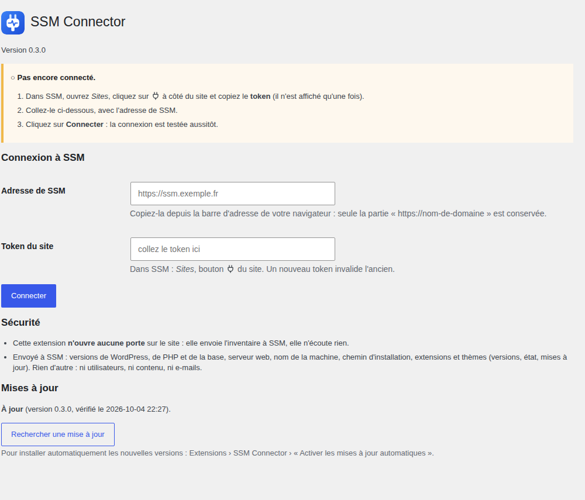
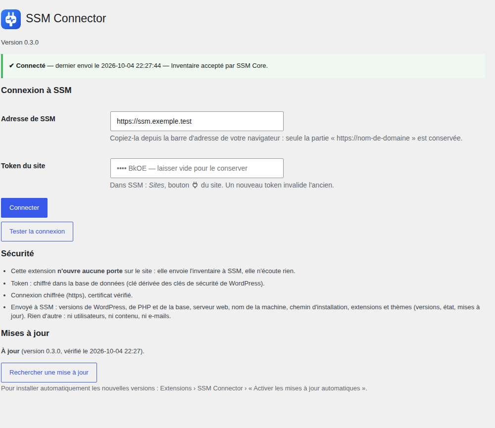
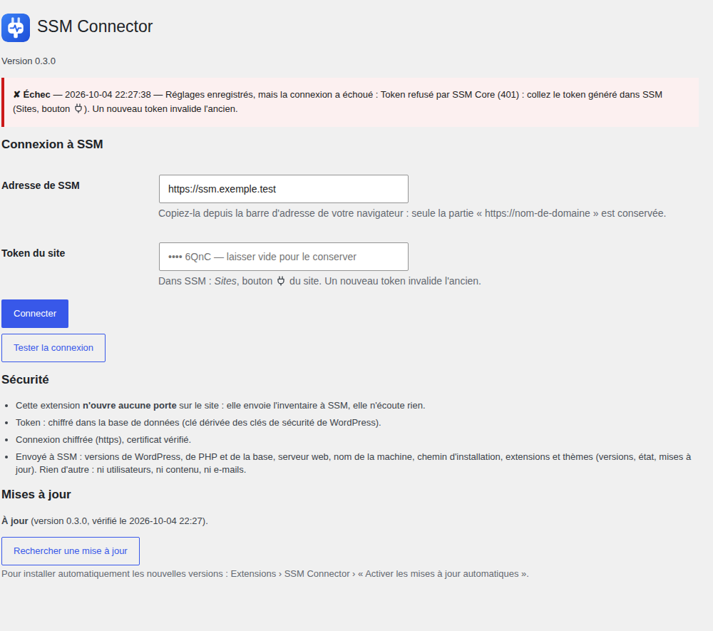
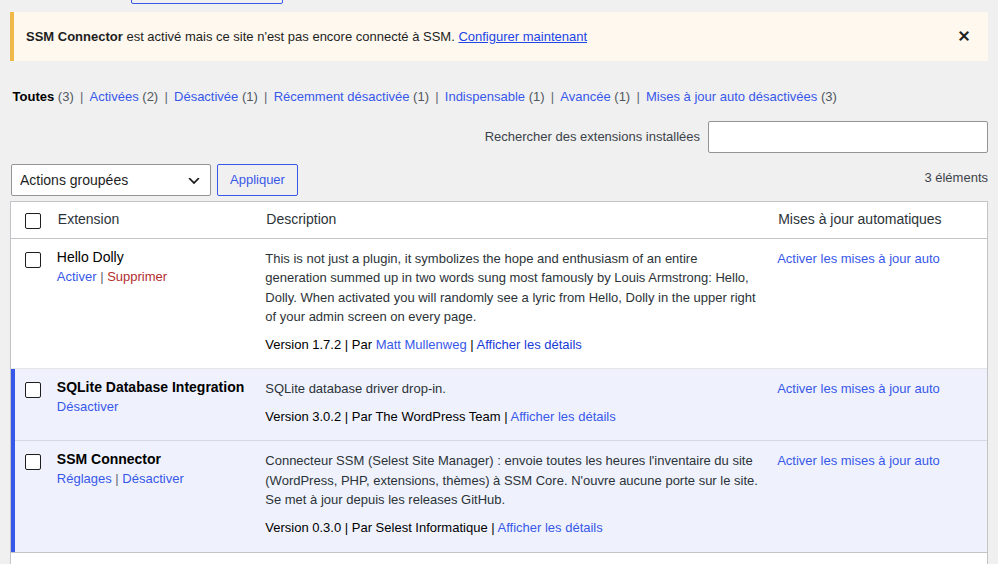
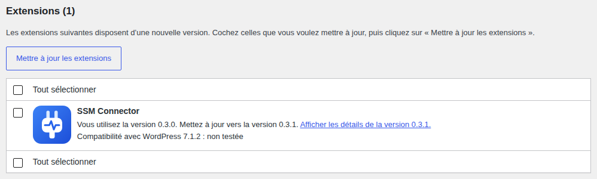
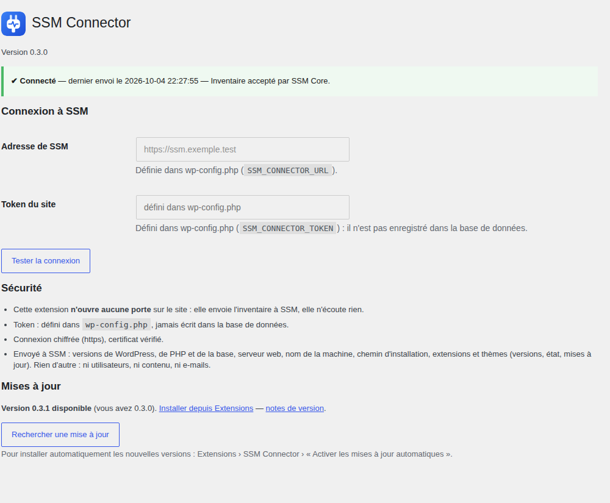

<p align="center"></p>

# SSM Connector — WordPress

Extension WordPress qui envoie à **SSM Core** (Selest Site Manager) l'inventaire du site : version de WordPress, de PHP et de la base,
extensions et thèmes (avec les mises à jour disponibles). L'envoi est automatique, toutes les heures ; une action
demandée dans SSM part en quelques minutes (voir « Ce que SSM peut demander »).

- **Facile** : une adresse, un token, un bouton **Connecter**. La connexion est testée aussitôt, le résultat est expliqué en clair.
- **Sûre** : n'ouvre **aucune porte** sur le site (elle envoie, elle n'écoute rien), token chiffré, https obligatoire hors réseau privé.
- **À jour** : se met à jour comme n'importe quelle extension WordPress, depuis les releases GitHub.

Elle ne modifie rien sur le site : elle ne fait que lire et envoyer.

## Aperçu

| | |
|---|---|
| **Avant la connexion** : le guide en trois étapes<br> | **Connecté** : état, dernier envoi, ce qui est protégé<br> |
| **Un échec expliqué** : la cause et la marche à suivre<br> | **Rappel** sur la liste des extensions tant que le site n'est pas connecté<br> |
| **Mise à jour disponible**, avec le logo<br> | **Configuration dans `wp-config.php`** : champs verrouillés, token hors base de données<br> |

## Installation

1. Télécharger `ssm-connector-wp.zip` depuis la [dernière release](https://github.com/fred-selest/ssm-connector-wp/releases/latest).
2. WordPress : **Extensions › Ajouter › Téléverser**, puis **Activer**.
   En ligne de commande : `wp plugin install ssm-connector-wp.zip --activate`.

Variante *mu-plugin* : copier **le fichier** `ssm-connector.php` directement dans `wp-content/mu-plugins/` (pas dans un sous-dossier :
WordPress n'y charge que les fichiers du premier niveau). Rien à activer ; pas de mises à jour automatiques dans ce cas.
Ne pas installer les deux variantes à la fois.

## Configuration

1. Dans SSM : **Sites**, bouton **🔌** du site, puis copier le **token** (il n'est affiché qu'une fois ; un nouveau token se génère au même endroit et invalide l'ancien).
2. Dans WordPress : **Réglages › SSM Connector**. Coller le token et saisir l'adresse de SSM : le plus simple est de la copier depuis la barre d'adresse du navigateur, seule la partie `https://nom-de-domaine` est conservée.
3. Cliquer sur **Connecter**. Les réglages sont enregistrés (le token chiffré) et un premier envoi est fait tout de suite : le résultat s'affiche en haut de la page.

Tant que le site n'est pas connecté, un rappel s'affiche sur le Tableau de bord et sur la liste des extensions.

### En ligne de commande

```
echo "$TOKEN" | wp ssm connect https://ssm.exemple.fr    # enregistre et teste (le token ne reste pas dans l'historique du shell)
wp ssm status                                           # configuration et dernier envoi (4 derniers caractères du token seulement)
wp ssm heartbeat                                        # renvoie l'inventaire maintenant
```

### Dans `wp-config.php` (déploiements en série, hébergeurs gérés)

```php
define('SSM_CONNECTOR_URL',   'https://ssm.exemple.fr');
define('SSM_CONNECTOR_TOKEN', 'le-token-du-site');
```

Ces constantes l'emportent sur la base de données ; **le token n'est alors jamais écrit dans la base**. Les champs de la page sont verrouillés.
Depuis WP-CLI : `wp config set SSM_CONNECTOR_TOKEN "$TOKEN" --type=constant`.

## Ce qui est envoyé

À chaque envoi, en HTTPS vers `<adresse>/api/v1/heartbeat`, avec l'en-tête `X-SSM-Token` :

| Donnée | Pourquoi |
|---|---|
| version de WordPress, de PHP et de la base, serveur web, nom de la machine, chemin d'installation, adresse du site | fiche du site dans SSM (l'adresse : suivre un passage en ligne) |
| extensions : identifiant, nom, version, active ou non, mise à jour disponible et version proposée | suivi des mises à jour et des vulnérabilités |
| thèmes : mêmes champs, plus le thème parent | idem |
| version du connecteur | savoir quels sites sont à jour |
| capacités (ce que le connecteur sait exécuter), version du cœur proposée | SSM n'envoie que ce que le connecteur sait faire |
| erreurs PHP : niveau, message, fichier et ligne relatifs au site, nombre d'occurrences | page « Erreurs PHP » et alertes de SSM |
| comptes rendus des mises à jour et des actions demandées | historique dans SSM |

Rien d'autre : ni utilisateurs, ni contenu, ni e-mails, ni identifiants de connexion.

## Ce que SSM peut demander

Rien n'est fait sans demande de SSM (bouton « Demander », ou site en politique automatique). Les demandes
arrivent dans la réponse au heartbeat ; le compte rendu part aussitôt après l'exécution.

Toutes les deux minutes, le connecteur demande à SSM si une action l'attend (`GET <adresse>/api/v1/connector/pending`,
avec `X-SSM-Token`, réponse `{"pending": true|false}`) et n'envoie son inventaire que si c'est le cas. Juste après
une demande, SSM appelle `wp-cron.php` du site (la page de WordPress qui fait tourner ses tâches planifiées) pour que
cette question parte même sans visiteur. Le connecteur n'écoute toujours rien.

| Demande | Ce que fait le connecteur |
|---|---|
| mise à jour d'une extension ou d'un thème | sauvegarde du dossier, mise à jour, version relue sur le disque, contrôle de la page d'accueil ; retour à la version précédente si le site casse |
| mise à jour du cœur | contrôle avant et après ; **pas de retour arrière automatique** (un site cassé est rapporté) |
| activer, désactiver, supprimer une extension | jamais une extension active supprimée, jamais le connecteur lui-même |
| installer une extension | depuis wordpress.org uniquement, non activée |
| sauvegarder le site | `database.sql` + `wp-config.php` + `wp-content` dans un zip, déposé sur l'URL pré-signée du stockage S3 de l'agence (SSM ne voit pas passer l'archive) |

## Connexion directe depuis SSM (facultative)

Fermée par défaut, et SSM ne peut pas l'ouvrir à distance. Pour l'ouvrir, un administrateur coche
« Autoriser la connexion directe depuis SSM » dans **Réglages › SSM Connector** et choisit l'administrateur
connecté (par défaut : le premier administrateur). Décocher la referme et efface la clé aussitôt.

Les constantes de `wp-config.php` **l'emportent sur la page** : `define('SSM_CONNECTOR_ALLOW_LOGIN', false);`
la verrouille fermée (case grisée), `true` l'ouvre ; `define('SSM_CONNECTOR_LOGIN_USER', 'identifiant');`
impose le compte. C'est utile à un hébergeur ou à un client qui veut l'interdire.

Une fois la connexion ouverte, SSM remet une clé propre au site. Chaque lien de connexion est signé avec cette clé,
valable 60 secondes, une seule fois, et uniquement pour ce site. C'est la **seule porte d'entrée** de l'extension,
et elle n'existe que si un administrateur l'a ouverte.

## Sécurité

- **Aucune porte d'entrée** par défaut : l'extension n'enregistre aucune route (ni REST, ni AJAX public) et n'écoute rien. La seule exception est la connexion directe, posée uniquement si un administrateur l'a ouverte (case de la page, ou `SSM_CONNECTOR_ALLOW_LOGIN`).
- **Token chiffré dans la base** (libsodium, clé dérivée des clés de sécurité de `wp-config.php`) : une sauvegarde de base ou une injection SQL en lecture ne révèle pas le token. Si ces clés changent, la page le signale et il suffit de recoller le token. Pour ne jamais l'écrire dans la base : constantes dans `wp-config.php`.
- **https obligatoire** hors réseau privé : une adresse `http://` vers Internet est refusée. Le certificat est toujours vérifié (il n'existe aucune option pour l'ignorer) et les redirections ne sont jamais suivies, pour que le token n'aille pas ailleurs.
- Le token n'est **jamais affiché en entier** (4 derniers caractères), jamais prérempli, jamais cité dans un message d'erreur.
- Page de réglages et boutons réservés à `manage_options`, protégés par un jeton anti-CSRF.
- Données minimales : voir ci-dessus.

Ce que cela ne couvre pas : un attaquant qui lit `wp-config.php` peut déchiffrer le token de la base (d'où l'option des constantes, qui évite le stockage mais pas la lecture du fichier) ; et le token ouvre l'API d'envoi de **ce site seul** côté SSM.

## Mises à jour

L'extension se met à jour depuis les releases GitHub de ce dépôt, avec les outils habituels de WordPress : **Extensions** (bouton « Mettre à jour »), **Tableau de bord › Mises à jour**, `wp plugin update ssm-connector`, ou automatiquement si l'administrateur active « Activer les mises à jour automatiques » sur la ligne de l'extension. WordPress vérifie deux fois par jour ; le bouton **Rechercher une mise à jour** de la page de réglages le fait tout de suite.

- Le paquet doit venir des releases de ce dépôt et sa somme **SHA-256** (fournie par GitHub) est contrôlée avant toute installation ; en cas d'écart, rien n'est installé.
- Le dossier installé est conservé, même s'il ne s'appelle pas `ssm-connector`.
- **Le dépôt doit être public** : aucun jeton GitHub n'est stocké sur les sites. Tant qu'il est privé, la page affiche « aucune release trouvée (dépôt introuvable ou privé) » ; le reste fonctionne.
- Désactiver : `define('SSM_CONNECTOR_DISABLE_UPDATES', true);` dans `wp-config.php`.
- Quiconque peut publier une release sur ce dépôt peut donc faire installer du code sur les sites qui ont activé les mises à jour automatiques : protéger le compte GitHub (authentification à deux facteurs).

## Compatibilité

WordPress 5.5 ou plus, PHP 7.4 ou plus (testé en CI sur 7.4, 8.1 et 8.3). Multisite : l'inventaire est celui du site sur lequel l'extension est active.

## Développement

```
php tests/run.php                 # tests sans WordPress (faux appels WP) + constantes de wp-config.php
sh scripts/check-version.sh       # la version est-elle la même partout ?
sh scripts/build-zip.sh dist      # construit les ZIP installables
```

**Publier une version** : mettre à jour la version dans `ssm-connector.php` (en-tête et constante), `readme.txt` (*Stable tag*) et `CHANGELOG.md`,
fusionner dans `main`, puis lancer le workflow **Release** (Actions › Release › Run workflow) avec le numéro de version.
Il contrôle la cohérence, exécute les tests, crée le tag et la release avec `ssm-connector-wp.zip` et `ssm-connector-wp-vX.Y.Z.zip`.
